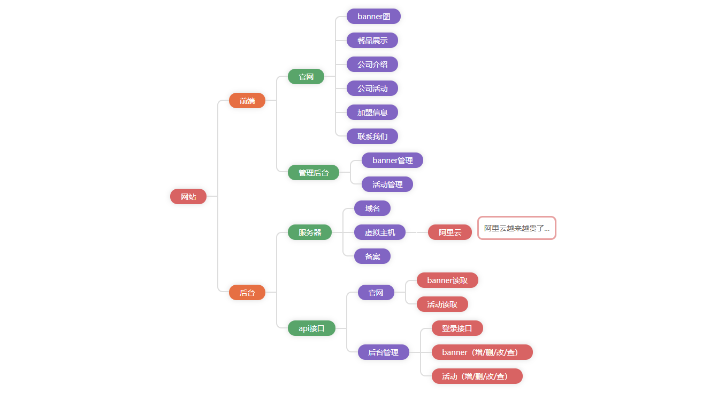

原生JS编写，兼容到IE10，可无线嵌套和自定义每一层的颜色以及以及每个区块的悬浮显示信息，用法参考：


```javascript
orgChart({
        el: 'org',
    	color: ['#d86363', '#e66f43', '#59a56a', '#8165c3'],
        data: {
            name: '网站',
            children: [{
                name: '前端',
                hover: '悬浮显示信息'
            }, {
                name: '后台',
            }],
        }
    });
```